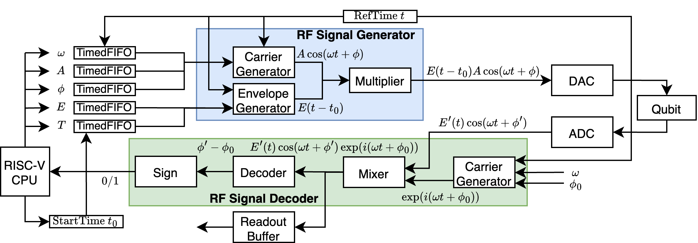

# RISC-Q

RISC-Q is an open-source generator of quantum control systems compatible with RISC-V. 

Currently, it generates SoCs that can be synthesized on Xilinx ZCU216 RFSoC development boards.

## Setup

The docker image for development can be built using `docker/build-docker.sh`. We recommend to develop using Dev Container.

## Quantum Control System

Quantum control systems generate the RF control signals that drive quantum systems, and process the readout signals from the quantum systems. 

An example of the measurement process on a superconducting qubit is illustrated in the following figure.

<p align="center">
 
</p>

A signal $E(t - t_0)A\cos(\omega t + \phi)$ that drives the measurement is send to the qubit, and the measurement result is decoded from the phase $\phi'$ of the readout signal $E'(t)cos(\omega t + \phi')$.

## Generation

To generate an SoC
```
mill runMain riscq.soc.GenMMSocVivado
```

## Testbench

Basic testbenches are available in `src/main/scala/riscq/tester/MMSocTestBench.scala`.

## Programming

Examples for RF signal processing can be found in `software-example`.