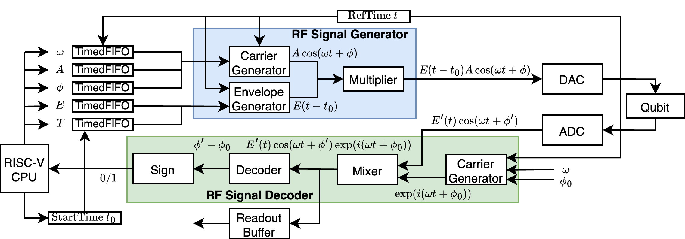

# RISC-Q

**Paper(available soon on arxiv): 
RISC-Q: A Generator for Real-Time Quantum Control System-on-Chips Compatible with RISC-V**

RISC-Q is an open-source generator of quantum control systems compatible with RISC-V. 

Currently, it generates SoCs that can be synthesized on Xilinx ZCU216 RFSoC development boards.

## Setup

The docker image for development can be built using `docker/build-docker.sh`. We recommend to develop using Dev Container.

## Quantum Control System

Quantum control systems generate the RF control signals that drive quantum systems, and process the readout signals from the quantum systems. 

An example of the measurement process on a superconducting qubit is illustrated in the following figure.

<p align="center">
 
</p>

A signal $E(t - t_0)A\cos(\omega t + \phi)$ that drives the measurement is send to the qubit, and the measurement result is decoded from the phase $\phi'$ of the readout signal $E'(t)cos(\omega t + \phi')$.

## Generation

To generate and synthesize the Verilog code of an SoC
```
mill runMain riscq.soc.GenMMSocVivado
cd build
../vivado-scripts/gen-bit.sh project-name
```

## Testbench

Basic testbenches are available in `src/main/scala/riscq/tester/MMSocTestBench.scala`.

## Programming

Examples for RF signal processing can be found in `software-example`.

## Architecture

The architecture of the RISC-Q is evolving towards:

<p align="center">
 
</p>

The current status is shown below, while the integration of a QEC decoder is under development.

<p align="center">
 
</p>

## Documentation

**The documentation is under construction.**

## Acknowledgements
- The RISC-V controller is built using the framework of [VexiiRiscv](https://github.com/SpinalHDL/VexiiRiscv), which supports highly parameterized pipeline and modular instructions.
- The integration of components makes heavy use of the [tilelink.fabric](https://spinalhdl.github.io/SpinalDoc-RTD/master/SpinalHDL/Libraries/Bus/tilelink/tilelink_fabric.html) library of SpinalHDL.

## Citing RISC-Q
```
@article{risc-q,
  author={Junyi Liu, Yi Lee, Haowei Deng, Connor Clayton, Gengzhi Yang and Xiaodi Wu},
  title={RISC-Q: A Generator for Real-Time Quantum Control System-on-Chips Compatible with RISC-V}, 
  year={2025},
}
```